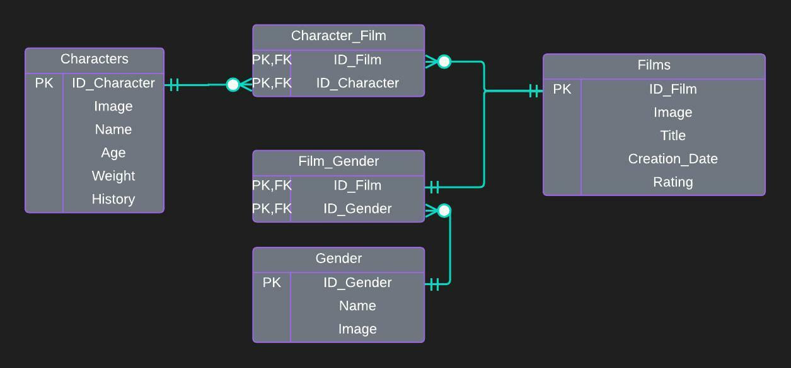

<div id="top"></div>

[![Issues][issues-shield]][issues-url]
[![MIT License][license-shield]][license-url]
[![LinkedIn][linkedin-shield]][linkedin-url]

<!-- PROJECT LOGO -->
<br />
<div align="center">
  <a href="https://github.com/ezevillafae/alkemy-challenge-disneyworld-springboot-rest-application">
    
  </a>

<h3 align="center">Alkemy Backend Java Challenge</h3>

  <p align="center">
    Developed REST API that allows browsing Disney characters and their movies.
    <br />
    <a href="https://github.com/ezevillafae/alkemy-challenge-disneyworld-springboot-rest-application"><strong>Explore the docs »</strong></a>
    <br />
    <br />
    <a href="https://github.com/ezevillafae/alkemy-challenge-disneyworld-springboot-rest-application">View Demo</a>
    ·
    <a href="https://github.com/ezevillafae/alkemy-challenge-disneyworld-springboot-rest-application/issues">Report Bug</a>
    ·
    <a href="https://github.com/ezevillafae/alkemy-challenge-disneyworld-springboot-rest-application/issues">Request Feature</a>
  </p>
</div>


<!-- TABLE OF CONTENTS -->
<hr>
<details>
  <summary>Table of Contents</summary>
  <ol>
    <li>
      <a href="#about-the-project">About The Project</a>
      <ul>
        <li><a href="#built-with">Built With</a></li>
      </ul>
    </li>
    <li>
      <a href="#getting-started">Getting Started</a>
      <ul>
        <li><a href="#prerequisites">Prerequisites</a></li>
        <li><a href="#installation">Installation</a></li>
      </ul>
    </li>
    <li><a href="#usage">Usage</a></li>
    <li><a href="#roadmap">Roadmap</a></li>
    <li><a href="#contributing">Contributing</a></li>
    <li><a href="#license">License</a></li>
    <li><a href="#contact">Contact</a></li>
    <li><a href="#acknowledgments">Acknowledgments</a></li>
  </ol>
</details>


<!-- ABOUT THE PROJECT -->
<div id="about-the-project"></div> 

## About The Project


The application allows to know and modify the
Disney's characters and understand in which films each of these characters participated.

<p align="right">(<a href="#top">back to top</a>)</p>

<div id="built-with"></div> 

### Built With

* Spring Boot
* Spring Data JPA
* Spring Security
* JWT.IO
* JUnit 5
* Mockito
* Lombok
* SendGrid
* MySQL

<p align="right">(<a href="#top">back to top</a>)</p>

## Database Diagram
<div style="text-align: center">
    
</div>

<!-- GETTING STARTED -->
## Getting Started

To get started follow the steps below.

### Prerequisites

* MySQL Server
* Enter the [Sendgrid](https://sendgrid.com/) website and generate a key


### Installation

1. Clone the repo
   ```sh
   git clone https://github.com/ezevillafae/alkemy-challenge-disneyworld-springboot-rest-application
   ```
2. Get a free API Key at [Sendgrid](https://sendgrid.com/)
3. Set the environment variable EMAIL_API_KEY with the value of the key generated in sengrid
4. Configure the property disney.app.email.sender in application.properties 

<p align="right">(<a href="#top">back to top</a>)</p>


<!-- USAGE EXAMPLES -->
## Usage


To test the app you can use the [Postman](https://www.postman.com/) tool.

the endpoints  post http://localhost:8080/movies/{id}/characters/{id} and
delete http://localhost:8080/movies/{id}/characters/{id} require authentication.

For register: POST http://localhost:8080/auth/register

   ```code
      //valid body
      {
       "username":"your.email@gmail.com",
       "password":"yourpassword"
      }
   ```

For login: POST http://localhost:8080/auth/login
   ```code
      //valid body
      {
       "username":"your.email@gmail.com",
       "password":"yourpassword"
      }
   ```

_For more examples, please refer to the [Documentation](https://example.com)_

<p align="right">(<a href="#top">back to top</a>)</p>

<!-- CONTRIBUTING -->
## Contributing

Contributions are what make the open source community such an amazing place to learn, inspire, and create. Any contributions you make are **greatly appreciated**.

If you have a suggestion that would make this better, please fork the repo and create a pull request. You can also simply open an issue with the tag "enhancement".
Don't forget to give the project a star! Thanks again!

1. Fork the Project
2. Create your Feature Branch (`git checkout -b feature/AmazingFeature`)
3. Commit your Changes (`git commit -m 'Add some AmazingFeature'`)
4. Push to the Branch (`git push origin feature/AmazingFeature`)
5. Open a Pull Request

<p align="right">(<a href="#top">back to top</a>)</p>


<!-- LICENSE -->
## License

Distributed under the MIT License. See `LICENSE.txt` for more information.

<p align="right">(<a href="#top">back to top</a>)</p>


<!-- CONTACT -->
## Contact

Ezequiel Villafañe - eze.villafae07@gmail.com
</br>
LinkedIn: https://www.linkedin.com/in/ezequiel-villafa%C3%B1e-149059172/
</br>
Project Link: https://github.com/ezevillafae/alkemy-challenge-disneyworld-springboot-rest-application

<p align="right">(<a href="#top">back to top</a>)</p>


<!-- ACKNOWLEDGMENTS -->
## Acknowledgments


* [Alkemy](https://www.alkemy.org/)

<p align="right">(<a href="#top">back to top</a>)</p>


<!-- MARKDOWN LINKS & IMAGES -->
<!-- https://www.markdownguide.org/basic-syntax/#reference-style-links -->

[repo-url]: https://github.com/ezevillafae/alkemy-challenge-disneyworld-springboot-rest-application
[issues-shield]: https://img.shields.io/github/issues/ezevillafae/alkemy-challenge-disneyworld-springboot-rest-application.svg?style=for-the-badge
[issues-url]: https://github.com/ezevillafae/alkemy-challenge-disneyworld-springboot-rest-application/issues
[license-shield]: https://img.shields.io/github/license/ezevillafae/alkemy-challenge-disneyworld-springboot-rest-application?style=for-the-badge
[license-url]: https://github.com/ezevillafae/alkemy-challenge-disneyworld-springboot-rest-application/blob/main/LICENCE.txt
[linkedin-shield]: https://img.shields.io/badge/-LinkedIn-black.svg?style=for-the-badge&logo=linkedin&colorB=555
[linkedin-url]: https://www.linkedin.com/in/ezequiel-villafa%C3%B1e-149059172

[product-screenshot]: images/screenshot.png
[contributors-shield]: https://img.shields.io/github/contributors/othneildrew/Best-README-Template.svg?style=for-the-badge
[contributors-url]: https://github.com/othneildrew/Best-README-Template/graphs/contributors

[stars-shield]: https://img.shields.io/github/stars/othneildrew/Best-README-Template.svg?style=for-the-badge
[stars-url]: https://github.com/othneildrew/Best-README-Template/stargazers
[license-shield]: https://img.shields.io/github/license/othneildrew/Best-README-Template.svg?style=for-the-badge
[license-url]: https://github.com/othneildrew/Best-README-Template/blob/master/LICENSE.txt
[product-screenshot]: images/project-screenshot.jpg

